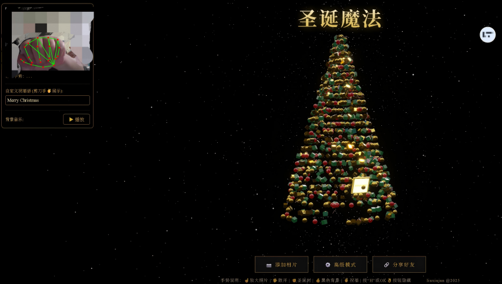

# christmas-tree-for-tiktok

A TikTok-style **gesture-controlled Christmas tree** demo: Three.js particle tree + MediaPipe hand tracking.

- Chinese README: `README.md`

## Live demo / Deployment
Recommended: deploy via **GitHub Pages** (HTTPS is enabled by default, so the camera works).

## Run locally (important)
Start a static file server (do NOT open via `file://`):

```bash
# Python
python3 -m http.server 8080

# or Node
npx serve .
```

Open: `http://localhost:8080/`

### Camera requirement (must-read)
Browser `getUserMedia` works only in a **secure context**:

- ✅ `https://` domains
- ✅ `http://localhost` / `http://127.0.0.1`
- ❌ other `http://` domains (camera will be blocked)

## Controls
### UI buttons
- **📷 Add Photos**: upload multiple images and they become photo particles on the tree.
- **⚙️ Advanced Mode**: toggle the debug panel (hand landmarks preview, greeting text input, music player).
- **🔗 Share**: copy current page URL.

### Keyboard
- `H`: hide/show UI (title + bottom buttons).

### Gestures (camera)
- ☝️ Index finger only: focus & enlarge a random photo (FOCUS).
- 🖐️ Open palm: scatter particles (SCATTER).
- ✊ Fist: build the Christmas tree (TREE).
- 👍 Thumbs up: switch to dark theme.
- ✌️ Victory: show golden greeting text (default: “Merry Christmas”).
- 👌 OK: hide/show UI (same as `H`).

## Customization
### Greeting text
Open “Advanced Mode” and edit the input (max 20 chars). Used by the ✌️ gesture.

### Background music
Edit in `index.html`:

```js
const AUDIO_URLS = [
  "Last-Christmas.mp3" // example: add this MP3 to the repo, or replace with your own file name/URL
];
```

- Place your MP3 in the repo (ensure the path is accessible).
- If you don't want music: set `AUDIO_URLS` to `[]`. 

## Assets
Offline-ready: Three.js, MediaPipe, model and WASM are included under `./libs/`.
